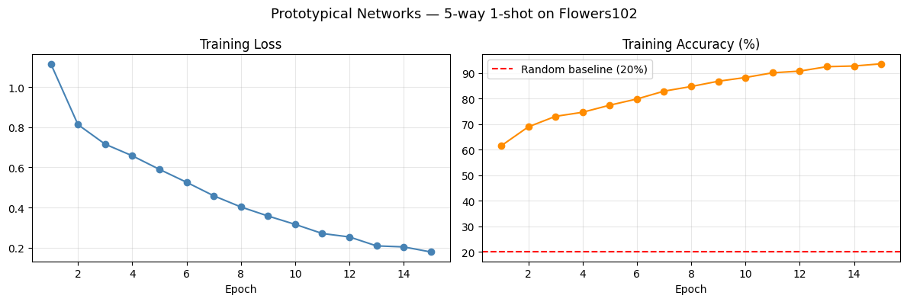
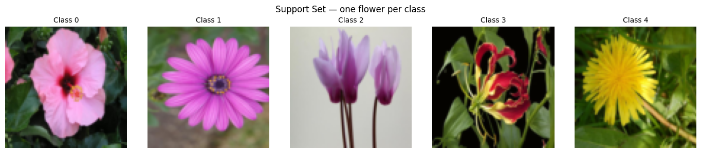
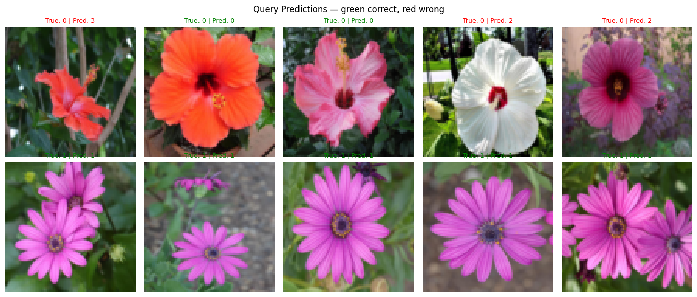

# Prototypical Networks for Few-Shot Learning on Real-World Flower Images
Oxford Flowers102 · 5-way 1-shot · PyTorch · RGB

## Results

| Metric | Value |
|---|---|
| Test accuracy | 73.11% ± 12.90% |
| Training accuracy (epoch 15) | 93.56% |
| Random baseline (5-way) | 20.00% |
| Classes | 102 flower species |
| Training episodes | 1000 per epoch |
| Episodes evaluated | 300 |
| Model parameters | 113,088 |

## Dataset

Oxford Flowers102 contains 102 flower species commonly found in the UK,
with 8189 images total across varying lighting, scale, and pose conditions.
Unlike controlled benchmarks, flower species frequently share similar colors,
petal structures, and backgrounds, making one-shot generalization across
classes genuinely difficult. Train and validation splits (1020 images each)
are combined for meta-training. The test split (6149 images) is held out
entirely for evaluation.

## Method

Prototypical Networks (Snell et al., 2017) learn a metric embedding space
where images from the same class cluster around a single prototype, computed
as the mean of support embeddings. At inference, a query image is assigned
to the nearest prototype by Euclidean distance.

Training follows an episodic structure that directly simulates few-shot
conditions. Each episode samples 5 flower species at random, assigns 1
support image per species, and evaluates classification on 5 query images
per species. The embedding network is a 4-block CNN operating on 84x84
RGB inputs, trained with Adam over 15 epochs of 1000 episodes each.
Test classes are never seen during training.

## Visualizations

## Notes

This project extends the episodic few-shot framework from handwritten
character recognition (see few-shot-omniglot) to real-world RGB images.
Flowers102 was chosen deliberately for its visual difficulty: inter-class
similarity forces the model to learn fine-grained discriminative features
rather than coarse color or shape statistics. The 73.11% test accuracy
against a 20% random baseline demonstrates that the learned embedding
space generalizes meaningfully to unseen flower species from a single
support example.

This work was built as preparation for research on few-shot object
detection, where classification from minimal examples must extend to
the harder joint problem of localizing objects in the scene.

## References

Snell, J., Swersky, K., & Zemel, R. (2017). Prototypical Networks for
Few-shot Learning. NeurIPS 2017.

Tian, Y., Wang, Y., Krishnan, D., Tenenbaum, J. B., & Isola, P. (2020).
Rethinking Few-Shot Image Classification: A Good Embedding is All You
Need? ECCV 2020.

Wang, X., Huang, T. E., Darrell, T., Gonzalez, J. E., & Yu, F. (2020).
Frustratingly Simple Few-Shot Object Detection. ICML 2020.
